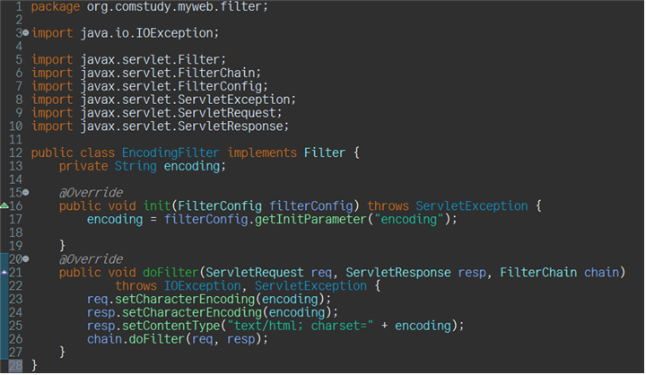
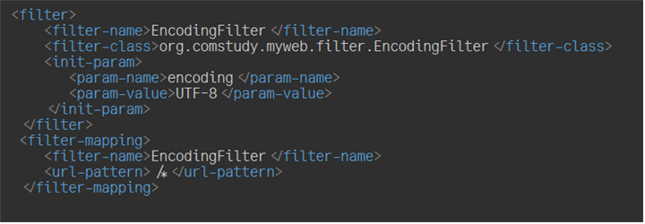
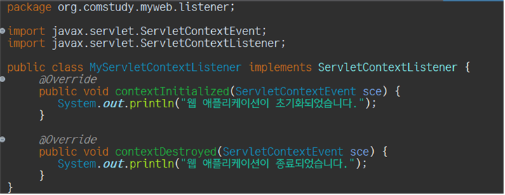
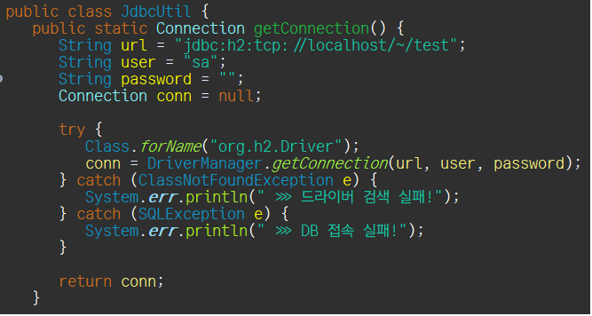
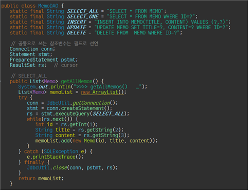
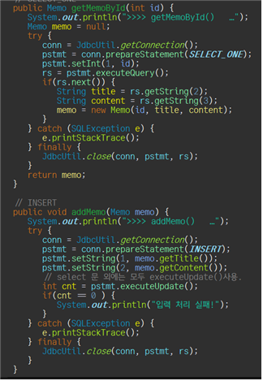
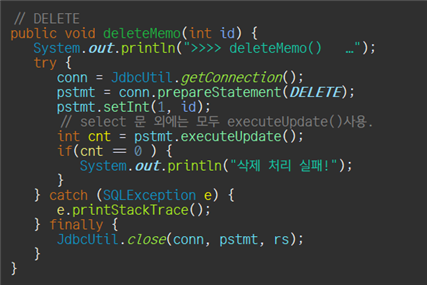

## ServerLet & JSP / Sync

어떤 HttpRequest를 요청하게 되면 Filter를 걸쳐 실행하게 된다.
다음과 같은 방식으로 코드를 작성하면 작동된다.

Listener를 통해 사이트에서 일어나는 이벤트들을 detect 할 수 있다.

## JDBC
다음은 JDBC를 위한 connection생성이다.

다음은 connection에 따른 CRUD의 구현이다.

PrepareStatement를 통해서 미리 ?에 해당하는 값을 줄 수 있고,
ruleset으로 받은 내용들을 처리할 수 있다.

Delete와 modify는 Update로 실행 되어야 한다!