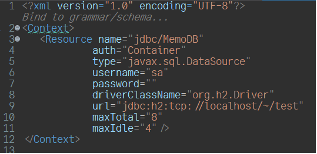
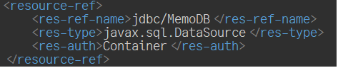
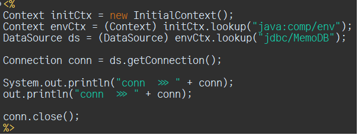
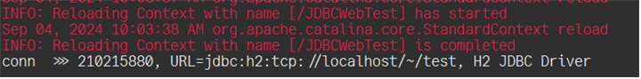
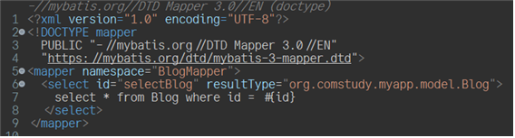
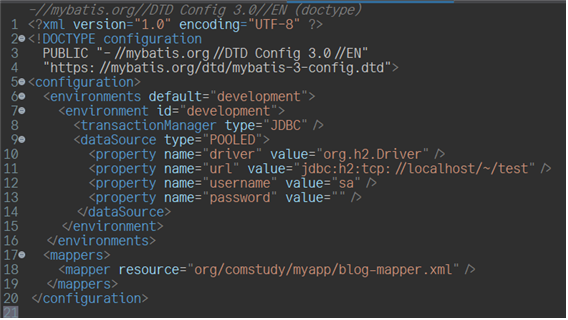
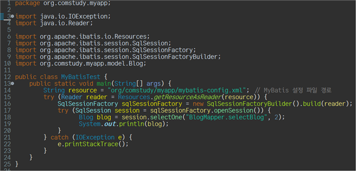
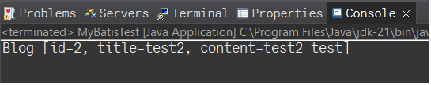
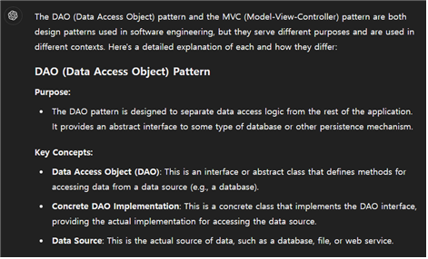
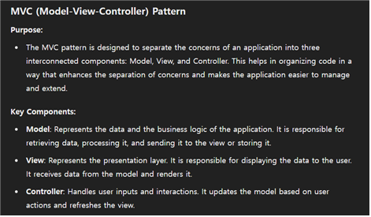

## JDBC

다음은 JDBC를 connection을 xml를 통해서 하는 방법이다.
META-INF에 context.xml을 다음과 같이 지정하여 driver를 연결한다.


resource-ref을 web.xml에 다음과 같이 지정하여 준다.


JSP에 해당 코드를 작성하면 connection이 활성화 된다.



(jsp를 실행시킬 때, WEB-INF에 jdbc 라이브러리가 등록되어 있지 않으면 문제가 발생하니 조심하도록 하자!)

## myBatis Programming

다음은 myBatis Programming을 위한 구현이다.
blog-mapper.xml


mybatis-config.xml


MyBatisTest.java



■ DAO pattern VS MVC pattern  
두 개 모두 유지보수성과 효율성을 위해 사용되는 것이고, 같이 쓰일 수 있다. 차이점은 DAO는 데이터베이스와의 상호작용을 위한 패턴이라 볼 수 있고, MVC는 앱의 관리가 효율적으로 작동되기 위하여 모델, 뷰, 컨트롤러로 분리하는 것을 뜻한다. 이 둘은 혼용될 수 있다.



## DAO pattern
BlogDAO.java
```java
package org.comstudy.myapp.model;

import java.io.IOException;
import java.io.Reader;
import java.util.List;

import org.apache.ibatis.io.Resources;
import org.apache.ibatis.session.SqlSession;
import org.apache.ibatis.session.SqlSessionFactory;
import org.apache.ibatis.session.SqlSessionFactoryBuilder;

public class BlogDAO {
private SqlSessionFactory sqlSessionFactory;

public BlogDAO() {
try {
String resource = "org/comstudy/myapp/mybatis-config.xml";
Reader reader = Resources.getResourceAsReader(resource);
sqlSessionFactory = new SqlSessionFactoryBuilder().build(reader);
} catch (IOException e) {
e.printStackTrace();
}
}

public Blog selectBlog(int id) {
try(SqlSession sqlSession = sqlSessionFactory.openSession()) {
BlogMapper blogMapper = sqlSession.getMapper(BlogMapper.class);
return blogMapper.selectBlog(id);
}
}

public List<Blog> selectAllBlog() {
try(SqlSession sqlSession = sqlSessionFactory.openSession()) {
BlogMapper blogMapper = sqlSession.getMapper(BlogMapper.class);
return blogMapper.selectAllBlog();
}
}

public void insertBlog(Blog blog) {
try(SqlSession sqlSession = sqlSessionFactory.openSession()) {
BlogMapper blogMapper = sqlSession.getMapper(BlogMapper.class);
blogMapper.insertBlog(blog);
sqlSession.commit();
}
}

public void updateBlog(Blog blog) {
try(SqlSession sqlSession = sqlSessionFactory.openSession()) {
BlogMapper blogMapper = sqlSession.getMapper(BlogMapper.class);
blogMapper.updateBlog(blog);
sqlSession.commit();
}
}

public void deleteBlog(int id) {
try(SqlSession sqlSession = sqlSessionFactory.openSession()) {
BlogMapper blogMapper = sqlSession.getMapper(BlogMapper.class);
blogMapper.deleteBlog(id);
sqlSession.commit();
}
}

//make a main method to check all methods
public static void main(String[] args) {
BlogDAO blogDAO = new BlogDAO();
Blog blog = blogDAO.selectBlog(1);
System.out.println("selected id: 1 => " + blog);
System.out.println();
System.out.println("list : ");
List<Blog> blogList = blogDAO.selectAllBlog();
for (Blog b : blogList) {
System.out.println(b);
}
System.out.println("----------------------------------------");

      blog = new Blog(6, "new title", "new content");
      blogDAO.insertBlog(blog);
      System.out.println("new blog inserted: " + blog);
      System.out.println();
      System.out.println("list : ");
      blogList = blogDAO.selectAllBlog();
      for (Blog b : blogList) {
         System.out.println(b);
      }
      System.out.println("----------------------------------------");
      
      blog.setTitle("updated title");
      blogDAO.updateBlog(blog);
      System.out.println("blog updated: " + blog);
      System.out.println();
      System.out.println("list : ");
      blogList = blogDAO.selectAllBlog();
      for (Blog b : blogList) {
         System.out.println(b);
      }
      System.out.println("----------------------------------------");
      
      blogDAO.deleteBlog(blog.getId());
      System.out.println("blog deleted: " + blog.getId());
      System.out.println();
      System.out.println("list : ");
      blogList = blogDAO.selectAllBlog();
      for (Blog b : blogList) {
         System.out.println(b);
      }
}
}
```
blogMapper.java
```java
package org.comstudy.myapp.model;

import java.util.List;

public interface BlogMapper {
Blog selectBlog(int id);
List<Blog> selectAllBlog();
void insertBlog(Blog blog);
void updateBlog(Blog blog);
void deleteBlog(int id);
}

blog.java
package org.comstudy.myapp.model;

public class Blog {
private int id;
private String title;
private String content;

	public Blog(int id) {
		this(id, "", "");
	}
	
	public Blog(String title, String content) {
		this(0, title, content);
	}
	
	public Blog(int id, String title, String content) {
		this.id = id;
		this.title = title;
		this.content = content;
	}

	public int getId() {
		return id;
	}

	public void setId(int id) {
		this.id = id;
	}

	public String getTitle() {
		return title;
	}

	public void setTitle(String title) {
		this.title = title;
	}

	public String getContent() {
		return content;
	}

	public void setContent(String content) {
		this.content = content;
	}

	@Override
	public String toString() {
		return "Blog [id=" + id + ", title=" + title + ", content=" + content + "]";
	}
}
```
blog-mapper.xml
```xml
<?xml version="1.0" encoding="UTF-8"?>
<!DOCTYPE mapper PUBLIC "-//mybatis.org//DTD Mapper 3.0//EN" "https://mybatis.org/dtd/mybatis-3-mapper.dtd">
<mapper namespace="org.comstudy.myapp.model.BlogMapper">
	<select id="selectBlog" resultType="org.comstudy.myapp.model.Blog">
		SELECT * FROM Blog WHERE id = #{id}
	</select>
	<select id="selectAllBlog" resultType="org.comstudy.myapp.model.Blog">
		SELECT * FROM Blog
	</select>
	<insert id="insertBlog" parameterType="org.comstudy.myapp.model.Blog">
		INSERT INTO BLOG(id, title, content) VALUES (#{id}, #{title}, #{content})
	</insert>
	<update id="updateBlog" parameterType="org.comstudy.myapp.model.Blog">
		UPDATE BLOG
		SET
		title=#{title}, content = #{content}
		WHERE
		id=#{id}
	</update>
	<delete id="deleteBlog" parameterType="org.comstudy.myapp.model.Blog">
		DELETE FROM BLOG WHERE ID = #{id}
	</delete>
</mapper>
```
mybatis-config.xml
```xml
<?xml version="1.0" encoding="UTF-8" ?>
<!DOCTYPE configuration
  PUBLIC "-//mybatis.org//DTD Config 3.0//EN"
  "https://mybatis.org/dtd/mybatis-3-config.dtd">
<configuration>
  <environments default="development">
    <environment id="development">
      <transactionManager type="JDBC"/>
      <dataSource type="POOLED">
        <property name="driver" value="org.h2.Driver"/>
        <property name="url" value="jdbc:h2:tcp://localhost/~/test"/>
        <property name="username" value="sa"/>
        <property name="password" value=""/>
      </dataSource>
    </environment>
  </environments>
  <mappers>
    <mapper resource="org/comstudy/myapp/blog-mapper.xml"/>
  </mappers>
</configuration>
```
결과물
```
selected id: 1 => Blog [id=1, title=updated title, content=test test]

list :
Blog [id=1, title=updated title, content=test test]
Blog [id=2, title=test2, content=test2 test]
Blog [id=5, title=new title, content=new content]
----------------------------------------
new blog inserted: Blog [id=6, title=new title, content=new content]

list :
Blog [id=1, title=updated title, content=test test]
Blog [id=2, title=test2, content=test2 test]
Blog [id=5, title=new title, content=new content]
Blog [id=6, title=new title, content=new content]
----------------------------------------
blog updated: Blog [id=6, title=updated title, content=new content]

list :
Blog [id=1, title=updated title, content=test test]
Blog [id=2, title=test2, content=test2 test]
Blog [id=5, title=new title, content=new content]
Blog [id=6, title=updated title, content=new content]
----------------------------------------
blog deleted: 6

list :
Blog [id=1, title=updated title, content=test test]
Blog [id=2, title=test2, content=test2 test]
Blog [id=5, title=new title, content=new content]
```
