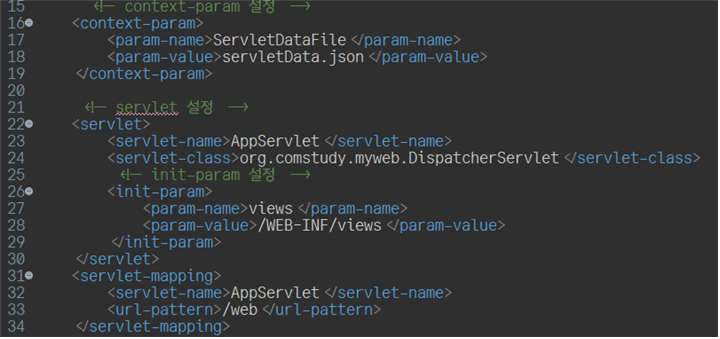
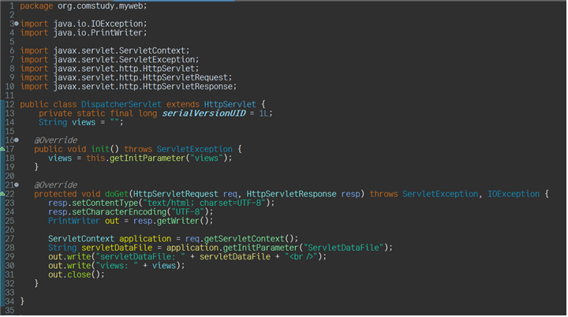
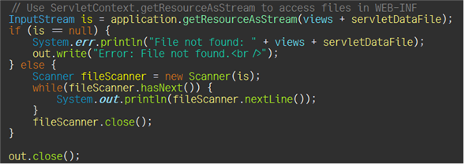
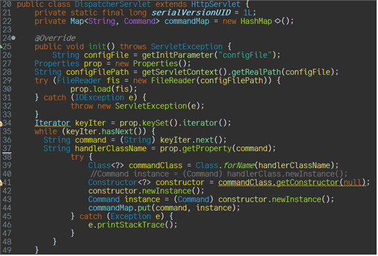
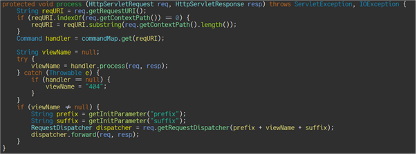
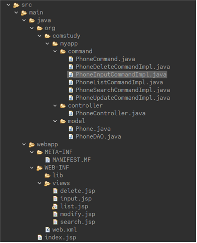

# ServerLet & JSP

## Calling web.xml parameters



## Calling json file


## DispatcherServlet
다음 코드는 dispatching을 위한 init과 keyIterator의 메소드이다.
Properties를 통해 configFile에 있는 servletContext를 가져오고, 파일을 FileReader를 통해 읽는다. prop.keySet에 내장되어 있는 iterator를 통해 들어오는 Key들을 prop.getProperty를 통해 Value를 꺼내오며 constructor를 불러오고, 새로운 인스턴스를 불러와 commandMap에다가 값을 저장한다.


## MVC Pattern Implementation
각 http 요청에 따라 process가 발동한다. 이 process가 불려지면 reqURI에 대한 value를 가져오고, viewName을 불러온다. 이렇게 하여 dispatch가 성공적으로 이루어 진다.


MVC를 구현되도록 하기 위해서 파일 분리를 해보자. 다음 과 같이 분리 할 수 있다.


View로 가도록 짜는 것은 getRequestDispatcher를 통해 할 수 있고, get, post 등은 command 쪽에서 관리하며, Controller가 페이지 연결을 할 수 있도록 도움을 준다. Model은 해당 과정들을 작동하기 위해 만들어져 있는 클래스들이다.

## SQL CRUD

```sql
DROP TABLE IF EXISTS users;

CREATE TABLE IF NOT EXISTS users (
    id INT AUTO_INCREMENT PRIMARY KEY,
    username VARCHAR(50) NOT NULL,
    email VARCHAR(100)
);

INSERT INTO users (username, email) VALUES
    ('john_doe', 'john@example.com'),
    ('jane_smith', 'jane@example.com');

SELECT * FROM USERS;

UPDATE users SET email = 'new_email@example.com' WHERE id = 1;

SELECT * FROM USERS WHERE ID=2;
DELETE FROM USERS WHERE ID=2;
```