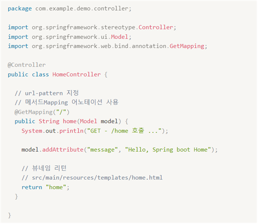
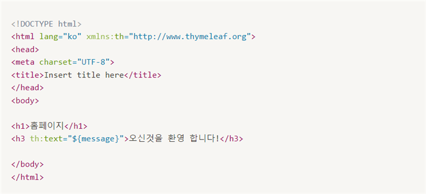
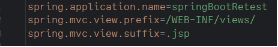
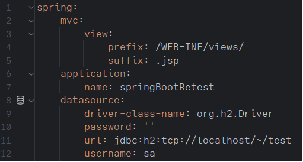
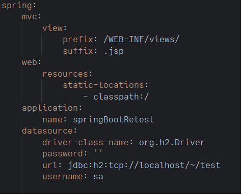

WebKit Day 29 – Spring Boot

## ThymeLeaf

src/main/resources/templates/home.html에 해당 내용을 저장하면 실행된다.

다음과 같이 실행하면 message가 불러와 지게 된다.

## JSP for Spring Boot
pom.xml에 jstl과 jsaper를 설정하여 주어야 한다.

properties에 내용을 다음과 같이 변경해 주어야 한다.

properties를 사용하지 않고 yml로 변경하여 더 편리하게 사용할 수 있다.

다음과 같이 static-location의 위치를 변경할 수 있다.

