# Spring DI

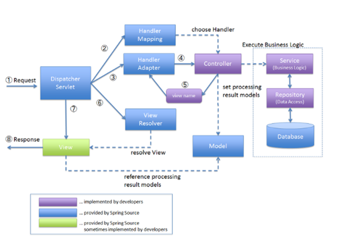
JAVA 디자인 패턴중 하나인 DI는 탬플릿메서드 패턴의 확장을 활용한 개념이다. SOLID원칙을 지키면서도 유연성이 생길 수 있도록 하는 패턴이다.
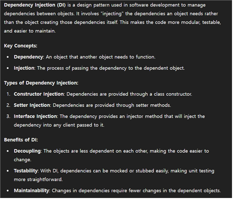
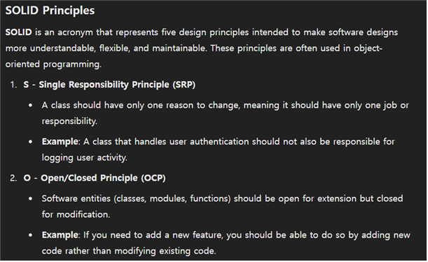
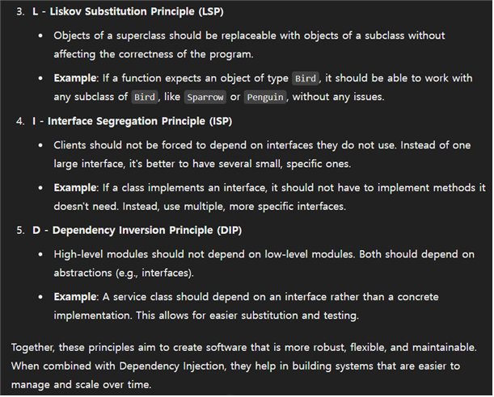

## Using xml to implement DI
메인에서 xml파일을 import 하도록 하여 실행되면, xml이 첫 실행을 통해 메모리 힙에 beans 생성이 자동으로 되게 하도록 해서 직접적인 생성자 생성 없이도 생성자 생성이 가능하도록 할 수 있다. @AutoWired을 사용하면 자동으로 하도록 할 수 있다.
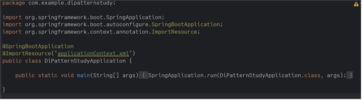
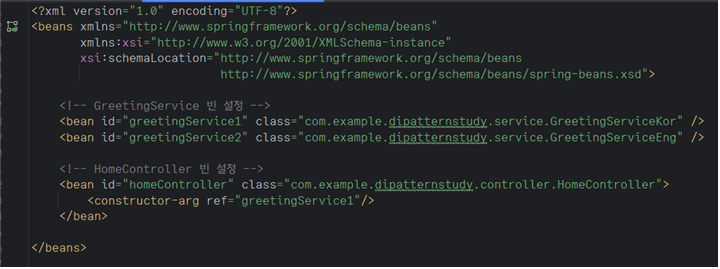

## Using @Autowired to implement DI
아래는 @Autowired를 사용한 것이다.
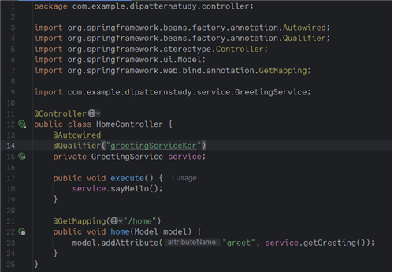
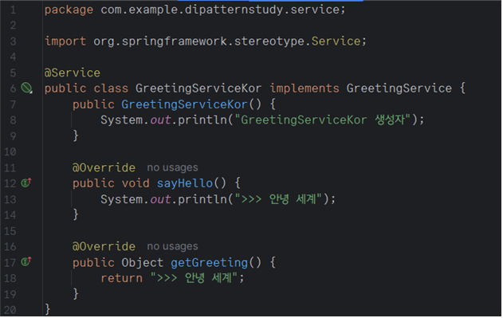
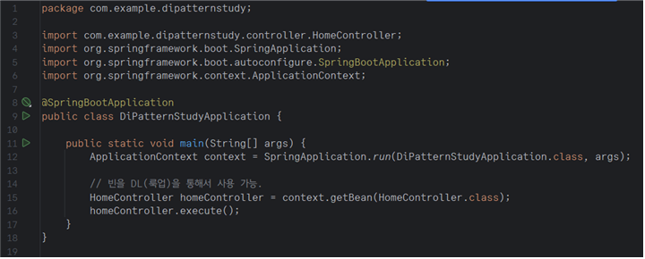

다음과 같이 lombok을 활용하여 테스트를 진행해 볼 수 있다.
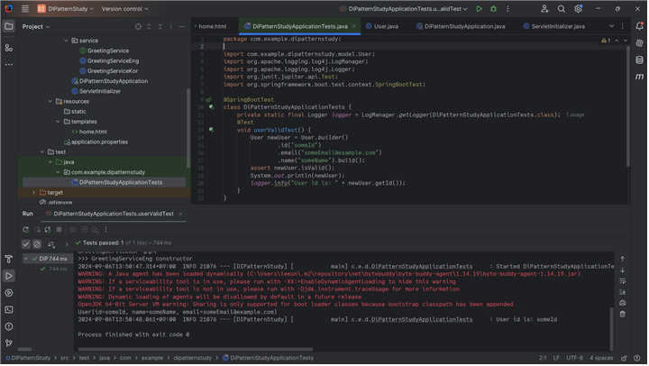

# Spring AOP
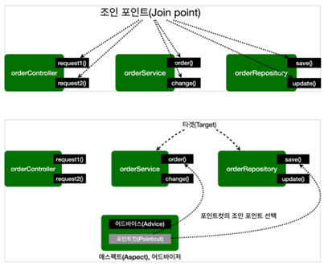
AOP는 관점 지향 프로그래밍으로, 코드외 횡단 관심사를 모듈화 하는 기법이다. 예를 들면 로깅, 트랜잭션 관리, 보안 등이 있다. 기존의 핵심 비즈니스 로직에 영향을 미치지 않으면서 코드를 재사용하고 유지보수하기 쉽도록 만들어 준다.

해당 코드는 AOP 방식으로 코드가 작동되는 방식에 대해서 보여준다. 
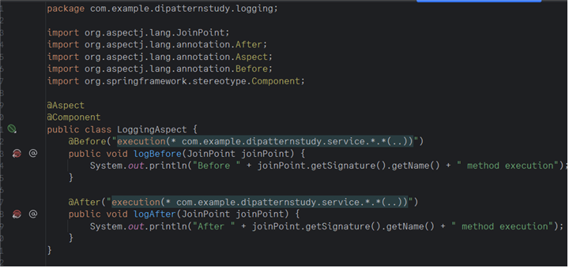
