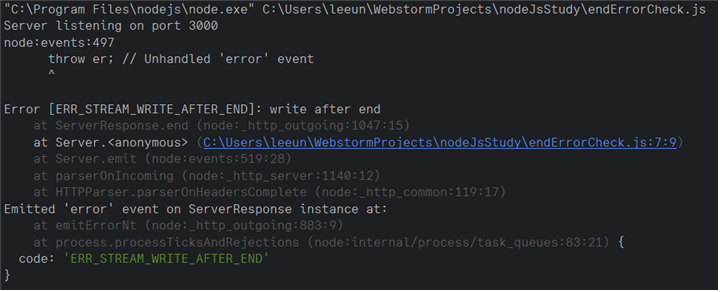
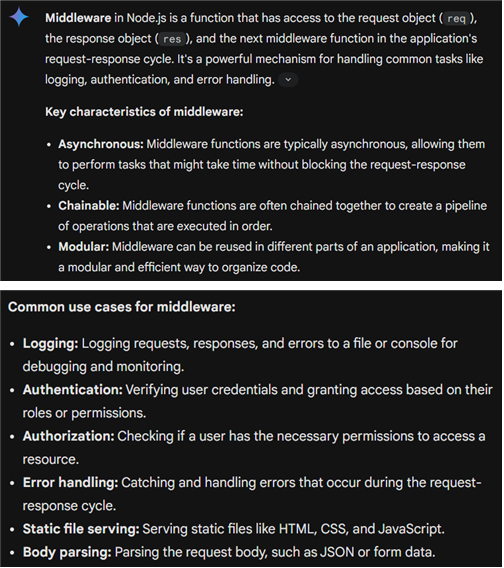

# Node.js tutorial
- Node.js는 자바스크립트를 활용하여 **서버를 만들 수 있는 개발 도구**이다. <br>
- Promise는 비동기 적인 작업을 실시할 때 **이벤트가 성공**하면 fulfill을 발생시키고, **성공하지 못하면** reject를 발동 시키는 방식이다. 항상 reject를 구현할 필요가 없다.


## Using http to see request, connection, close
node.js를 활용하기 위해 사용하는 코드이다. 
```js
var http = require('http');
var server = http.createServer();

server.on('request', function (req, res) {
    res.end('Hello');
})
server.on('connection', function (session) {
    console.log('Client connected');
})
server.on('close', function() {
    console.log('Server closed');
})
server.listen(3000, function () {
    console.log('Server is running at http://localhost:3000/');
});
```

## checking http connection event

```js
function task1(fulfill, reject) {
    console.log('task1 ...');
    let num = 0;
    setTimeout(function() {
        num = 1004;
        fulfill({data: 'task1 result', num});
    }, 300);
    console.log('task1 end', num);
}

function fulfilled(result) {
    console.log('fulfilled:', result.data, result.num);
}

function rejected(error) {
    console.log('rejected:', error);
}

new Promise(task1).then(fulfilled, rejected);

```
사이트 연결이 확실하다 판단이 될 때 **사이트가 icon을 가져오게 되는데**, 이때 connection이 한번 발생하고, **실제로 사이트로 접속하게 되었을 때** connection이 한번 더 발생하면서 connection이 2번 발생하게 된다. 


## calling html on http
```js
var http = require('http');

var server = http.createServer();
server.listen(3000, () => {
    console.log("http://localhost:3000");
});

const html = `
<!DOCTYPE html>
<html lang="ko">
    <head>
        <title>Node.js응답</title>
        <meta charset="UTF-8" />
    </head>
    <body>
        <h1>Nodejs 응답 페이지</h1>
    </body>
</html>
`;

server.on('request', (req, res) => {
    console.log('>>> 클라이언트 요청이 들어왔습니다.');
    //res.writeHead(200, {"Content-Type": "text/html; charset=utf-8"});
    res.write(html);
    res.end();
});

```
js에 클라이언트 요청이 들어오면 ``write()``를 통해 데이터를 불러낼 수 있고, 
이 응답을 ``end()``를 통해 부른다. ``send()``를 통해 객체 등을 body에 바로 출력할 수 있다. 

## sending end twice 

```js
const http = require('http');

const server = http.createServer((req, res) => {
    res.end('Hello, world!');

    // This will cause an error:
    res.end('Another response');
});

server.listen(3000, () => {
    console.log('Server listening on port 3000');
});

```

다음 코드는 에러를 발생시킨다.




## Node file System
노드의 파일 시스템은 동기식 IO와 비동기식 IO를 함께 제공하여 준다. 단 비동기식 IO에서는 콜백을 사용한다. 

```js
var fs = require('fs');
var data = fs.readFileSync("./tsconfig.json", 'utf8')
console.log(data);

```

~~아니 와 ㅁㅊ 이걸 한줄로 한다고요? C++ 가면 ``fstream``으로 파일 읽고 하나씩 스트링에 담아야 하고 Java 같은 경우에는 ``InputStreamReader`` 같은거 써서 가져와야 하는데 이걸 한방에 그냥 처리한다구요? 에이 한글자 씩 읽는거 따로 있었네 넘어가죠?~~

## Express

- express() 메소드를 호출하여 만든 app 객체는 ``set, get, use, post``가 있다.
- 주요 속성으로는 env, views, view engine 등이 있다.
- 보통 ``view engine``은 ``ejs``나 ``pug``를 많이 사용한다. ``ejs``는 servlet 기술의 JSP 탬플릿과 유사한 모양을 하고 있다.
- ``Middleware``를 통해 클라이언트에 응답을 보낼 수 있다. ``Middleware``은 함수에 ``req``와 ``res``를 인자로 가
지고 있는 함수를 말한다. 

